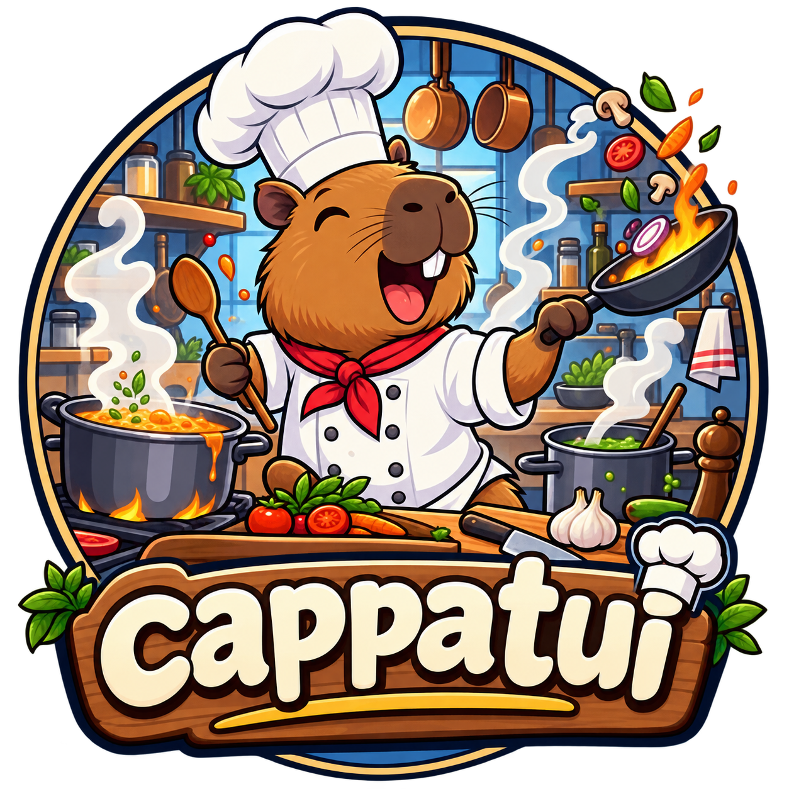

# cpp-tui



A C++ port of [termui](https://github.com/gizak/termui) — a terminal UI library with a widget set, a buffer-based rendering model, and an event loop.

Built on **ncurses** (wide-char variant for Unicode), compiled with **CMake**, written in **C++17**.

---

## Quick start

```bash
git clone <this-repo> tui-cpp
cd tui-cpp
cmake -B build
cmake --build build
./build/examples/hello_world
```

Requires `libncursesw` and a C++17 compiler (GCC 9+ or Clang 10+).

---

## Hello World

```cpp
#include <tui/tui.hpp>

int main() {
    tui::init();

    tui::widgets::Paragraph p;
    p.title = "tui-cpp";
    p.text  = "Hello World!\n\nPress any key to exit.";
    p.setRect(0, 0, 30, 7);   // x1, y1, x2, y2

    tui::render({&p});

    auto events = tui::pollEvents();
    events->pop();   // block until a key is pressed
    events->stop();

    tui::close();
}
```

---

## Architecture

```
tui::init()          — initialise ncurses
tui::render({...})   — draw widgets to screen
tui::pollEvents()    — start background event thread → EventChannel
tui::close()         — tear down ncurses
```

Every widget inherits from `tui::Block`, which handles the border, title, and inner rectangle.  
`setRect(x1, y1, x2, y2)` positions a widget.  
`render()` takes any mix of widgets and flushes them in one call.

---

## Widgets

| Widget | Header | Description |
|---|---|---|
| `Paragraph` | `widgets/paragraph.hpp` | Styled text with optional word-wrap. Supports inline markup. |
| `List` | `widgets/list.hpp` | Scrollable row list with selection highlight. |
| `BarChart` | `widgets/barchart.hpp` | Vertical bars with labels and value annotations. |
| `Gauge` | `widgets/gauge.hpp` | Horizontal progress bar with percentage label. |
| `Plot` | `widgets/plot.hpp` | Line chart using Unicode braille for high-resolution curves. |
| `Table` | `widgets/table.hpp` | Rows and columns with separators and per-row styles. |
| `SparklineGroup` | `widgets/sparkline.hpp` | Stacked compact bar strips (`▁▂▃▄▅▆▇█`) for multiple series. |
| `StackedBarChart` | `widgets/stacked_barchart.hpp` | Bars split into coloured segments per data layer. |
| `TabPane` | `widgets/tabs.hpp` | Horizontal tab bar; call `focusLeft()`/`focusRight()` to switch. |
| `Tree` | `widgets/tree.hpp` | Collapsible/expandable tree of `TreeNode`s. |
| `PieChart` | `widgets/piechart.hpp` | Filled pie slices with optional label callbacks. |

---

## Layout with Grid

`Grid` divides a rectangle into rows and columns using ratios instead of pixel coordinates.

```cpp
tui::Grid grid;
grid.set({
    tui::gridRow(0.5, {
        tui::gridCol(0.5, &widgetA),
        tui::gridCol(0.5, &widgetB),
    }),
    tui::gridRow(0.5, {
        tui::gridCol(1.0, &widgetC),
    }),
});
grid.setRect(0, 0, cols, rows);
tui::render({&grid});
```

Ratios are fractions of the parent dimension and should sum to 1.0 within each level.

---

## Inline style markup

Any widget that renders text (e.g. `Paragraph`) supports inline markup:

```
[text](fg:color, bg:color, mod:modifier)
```

Colors: `red` `green` `yellow` `blue` `magenta` `cyan` `white` `black` `clear`  
Modifiers: `bold` `underline` `reverse`

```cpp
para.text = "[warning](fg:yellow,mod:bold): disk usage at [92%](fg:red)";
```

---

## Event loop

```cpp
auto events = tui::pollEvents();   // starts background thread

while (true) {
    tui::Event e;
    if (events->tryPop(e)) {       // non-blocking
        if (e.type == tui::EventType::Keyboard) {
            if (e.id == "q") break;
        }
        if (e.type == tui::EventType::Resize) {
            // e.resize.width, e.resize.height
        }
    }
    // ... update data, re-render
}

events->stop();
tui::close();
```

Common key ids: `"q"`, `"<Up>"`, `"<Down>"`, `"<Left>"`, `"<Right>"`,  
`"<Enter>"`, `"<Escape>"`, `"<Tab>"`, `"<Backspace>"`, `"<C-c>"`, `"<F1>"` … `"<F12>"`

---

## Examples

| Binary | Source | Shows |
|---|---|---|
| `hello_world` | `examples/hello_world.cpp` | Minimal paragraph, wait for keypress |
| `demo` | `examples/demo.cpp` | Paragraph, List, BarChart, Gauge — animated |
| `demo2` | `examples/demo2.cpp` | Plot + Table laid out with Grid |
| `demo3` | `examples/demo3.cpp` | Tabs switching between Sparkline, StackedBarChart, PieChart, Tree, StyleParser |
| `demo_mouse` | `examples/demo_mouse.cpp` | 4-panel 2×2 grid; mouse focus, click-to-select, scroll wheel |
| `demo_mouse2` | `examples/demo_mouse2.cpp` | Same 4 panels with [+] expand-to-fullscreen and tab bar navigation |

---

## Project structure

```
tui-cpp/
├── CMakeLists.txt
├── include/tui/
│   ├── tui.hpp              ← include this and you get everything
│   ├── geometry.hpp         ← Point, Rect
│   ├── style.hpp            ← Color, Modifier, Style
│   ├── cell.hpp             ← Cell
│   ├── buffer.hpp           ← Buffer (drawing surface)
│   ├── drawable.hpp         ← Drawable interface
│   ├── block.hpp            ← Block base class
│   ├── theme.hpp            ← Global Theme defaults
│   ├── terminal.hpp         ← init, close, render, terminalSize
│   ├── events.hpp           ← pollEvents, EventChannel, Event
│   ├── canvas.hpp           ← BrailleCanvas
│   ├── style_parser.hpp     ← parseStyles()
│   ├── grid.hpp             ← Grid, gridRow, gridCol
│   ├── symbols.hpp          ← Unicode box-drawing constants
│   ├── utf8.hpp             ← UTF-8 → UTF-32 decoder
│   └── widgets/
│       ├── paragraph.hpp
│       ├── list.hpp
│       ├── barchart.hpp
│       ├── gauge.hpp
│       ├── plot.hpp
│       ├── table.hpp
│       ├── sparkline.hpp
│       ├── stacked_barchart.hpp
│       ├── tabs.hpp
│       ├── tree.hpp
│       └── piechart.hpp
└── src/                     ← implementations mirror include/tui/
```

---

## Building your own app

```cmake
# CMakeLists.txt
add_executable(myapp main.cpp)
target_link_libraries(myapp PRIVATE tui)
```

Or add tui-cpp as a subdirectory:

```cmake
add_subdirectory(tui-cpp)
target_link_libraries(myapp PRIVATE tui)
```

---

## Built with Claude

This project was written entirely through a conversation with
[Claude Code](https://claude.ai/code) (Anthropic, model: claude-sonnet-4-6).
No code was written by hand — every file was generated by the model in
response to the prompts below.

The session followed a plan-then-implement loop: Claude read the original
Go source from GitHub, proposed an architecture, got approval, then wrote
all headers, implementations, and examples in one continuous session.

### Prompts used

1. *"using cmake c++ port https://github.com/gizak/termui to c++ please. use the local folder. work step by step using a plan. write understandable easy to read code. document your progress. dont overthink it."*

2. *"nice, thanks. so i see bar chart, guage, paragraph and list. what other features are there that can be demoed?"*

3. *"please generate a second example that exercises those, like the first example app."*

4. *"nice. whats left"*

5. *"please implement Still in termui (straightforward ports): list."*

6. *"need to commit this first."*

7. *"please, generate a markdown readme.md as an intro to the repo, and a cheatsheet.md for new users of the API"*

8. *"update the README to include a section acknowledging claude's participation and list the prompts used."*
